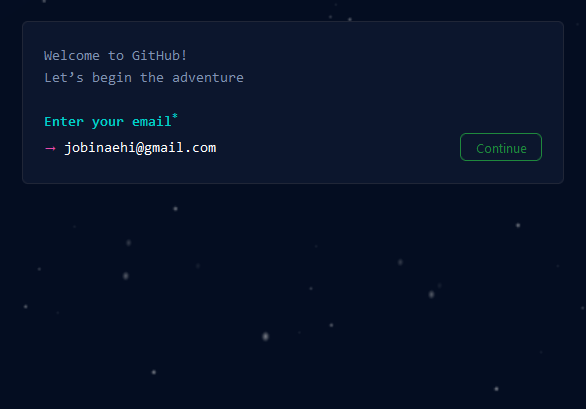
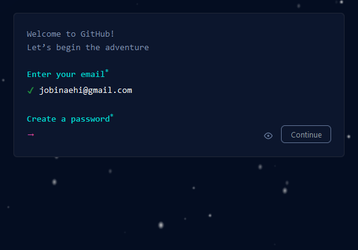
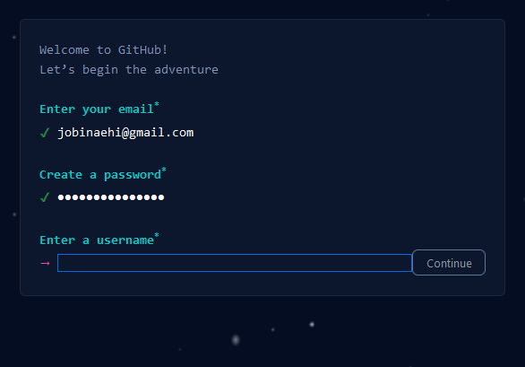
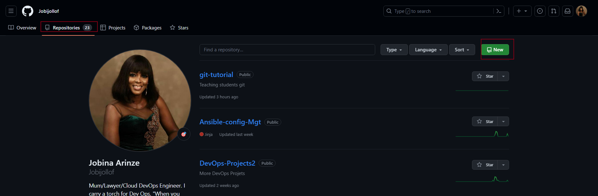
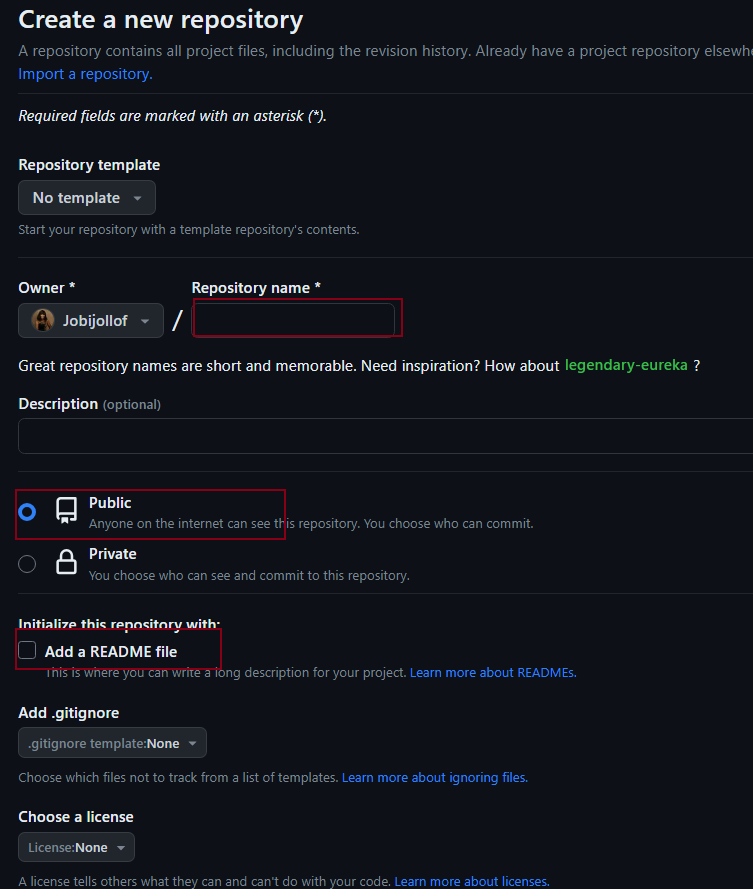
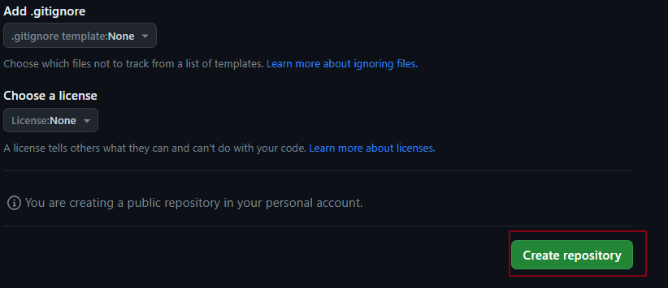

Markdown cheat [sheet](https://www.markdownguide.org/cheat-sheet/)

# Setup a Github Account

## Visit Github Website

-  Go to the Github [Website](https://github.com)

## Sign Up

Click on the "Sign up" button


## Create an Account

Fill in the required information:

Username: Choose a unique username that will be part of your GitHub profile URL (e.g., github.com/yourusername).

Email Address: Use a valid email address that you have access to.







Password: Choose a strong password.

Verify the reCAPTCHA: Complete the reCAPTCHA verification.

## Complete Account Setup

You'll be asked to verify your email address. GitHub will send you a verification email. Check your email inbox and click on the verification link provided in the email.

## Personalize Your Profile

After verification, you'll be prompted to personalize your profile. You can add a profile picture, bio, and other details.

## Configure Your Identity

After installing Git, open a terminal and set your identity using the following commands. Replace "Your Name" and "your@email.com" with your actual name and email address.


## Setting Up Git
To work with GitHub repositories locally, you'll need to have Git installed on your computer. You can download and install Git from the official [website:](https://git-scm.com/)

```
git config --global user.name "Your Name"
git config --global user.email "your@email.com"

```
## Create a Repository
A repository (or repo) is a place where your code and project files are stored. You can either create a repository on GitHub (or other Git hosting services) or locally on your computer. To create a local repository, navigate to your project folder in the terminal and run:

`git init`


# Create a Repository on github

Navigate to your repositories tab.
Select "New"




### Repository Settings:



Choose a name for your repository. This should be a unique and meaningful name that reflects the purpose of the repository.
Add an optional description to provide more context about the repository.
Choose whether the repository should be public (visible to everyone) or private (visible only to collaborators).
Optionally, initialize the repository with a README file, which can provide information about the project.
You can also add a .gitignore file to specify which files should be ignored by Git.License and Other Settings:

### Choose a license for your repository. 
GitHub provides a list of commonly used licenses.
You can also choose to add a .gitignore and a README file. These files can help set the initial structure of your repository.

### Create Repository

Once you've filled in the necessary details, click the "Create repository" button.




### Add and Commit Files

Add your project files to the repository using the git add command. For example, to add all files, use:

`git add .`

Then, commit the changes with a meaningful message:

```
git commit -m "Initial commit"

```

### Push Your Code

If you're working with a remote repository, use the git push command to upload your local changes to the remote repository:

`git push`


