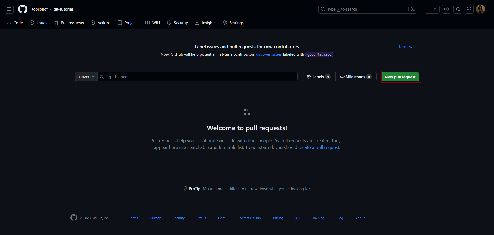
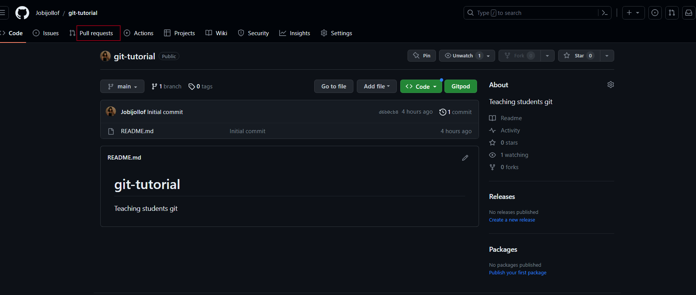

# Git Clone

Using git clone is a common way to contribute to GitHub repositories. It allows you to create a local copy of a remote repository on your computer, make changes, and then push those changes back to the repository. 

Here's a step-by-step guide:

## Find a Repository
## Oluwani oluso aguntanmi

Identify the GitHub repository you want to contribute to. You can find repositories by searching on GitHub or through links shared by others.

Get the Repository URL:
On the repository's GitHub page, click the "Code" button to reveal the repository's URL. Copy the URL.


## Clone the Repository

Open your terminal and navigate to the directory where you want to clone the repository. Use the git clone command followed by the repository URL you copied:

```
git clone <repository_url>

```
## Navigate to the Cloned Repository 

Change into the directory of the cloned repository

```
cd <repository_name>

```
## Create a Branch

It's a good practice to work on a separate branch for your changes. Create a new branch using the git checkout command:

```
git checkout -b <branch_name>

```
### Make Changes

Open the files you want to modify in your favorite code editor and make your changes.

### Add and Commit Changes

Add your changes to the staging area using git add:

`git add .``

Commit your changes with a descriptive message:

git commit -m "Add feature XYZ"

### Push Changes to GitHub

Push your changes to the remote repository on GitHub:

```
git push origin <branch_name>

```

Create a Pull Request:
On GitHub, navigate to the repository's page. If you pushed changes to a new branch, you'll see a banner suggesting you create a pull request (PR). Click the "Compare & pull request" button to initiate the PR.





## Review and Merge

Contributors and maintainers will review your changes. Discuss any necessary changes or improvements. Once approved, the changes can be merged into the main branch.

Congratulations! You've contributed to a GitHub repository using the git clone method. Remember that open source collaboration involves communication and teamwork. Always follow the repository's contributing guidelines and be respectful to maintainers and other contributors.


